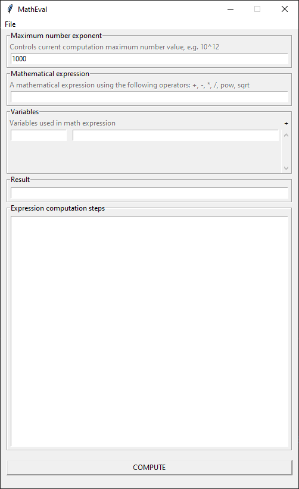
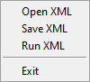
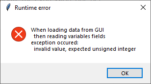

How to run
==========

Requirements
************

The application has been tested using python 3.8.0, with no external depencies.

Usage
*****

The application is based on a graphic user interface (GUI) and can be started from :code:`src/main.py`.

|

There are two ways for interacting with the GUI, directly using the input fields or using XML formated documents.

Direct Interaction 
^^^^^^^^^^^^^^^^^^
There are multiple input fields and two output fields. The input data, like the math formula, variables and the exponent, can be directly typed into fields. And as output, the application will display the formula result, the steps to get from the expression form to results or an error window if an exception case is reached.  

**Exponent field.**
Expects an unsigned integer that represent the maximum number the application can work with, e.g. an expoenent with value of :code:`10` represents that the maximum value for integers and operation results is :code:`10` raised to the power :code:`10`, resulting in :code:`10000000000`.  

**Formula field.**
Expects a arithmetic expression that can combine user defined variables and unsigned integers , e.g. :code:`2 * (10 + a) - 1`, with the following operators:

* addition (*operator* :code:`+`)
* substraction (*operator* :code:`-`)
* multiplication (*operator* :code:`*`)
* integer division (remainder is discarded) (*operator* :code:`/`)
* square root (*function* :code:`sqrt(...)`)
* power (*function* :code:`pow(...)` or *operator* :code:`**`)

**Variable fields.**
A variable is represented by a pair between a name and the value of the variable. The name field of the variable must be of lenght :code:`1`, e.g. :code:`a`, :code:`b`, :code:`c`, ..., :code:`z`, :code:`A`, ..., :code:`Z`. Also the variable value must be an integer constant. Multipe variables can be used by pressing the `+` button on the top right of the :code:`Variables` group, or removed by emptying the linked fields.

**Result fields.** If the computation successfully finishes, the field will contain the expression result in the form of an unsigned integer. If a negative integer is reached during computation an exception will be raise, as explained in the following section :ref:`Exception Cases`.

**Steps field.** If the computation successfully finishes, the read-only text area will contain the steps performed to reach the final result, one step per line. For exemple, the steps performed for the expression :code:`2 * ( 2048 + 1 )` would be:

.. code-block::

    (2 * ((2048 + 1) * (3 ** 5)))
    (2 * (2049 * (3 ** 5)))
    (2 * (2049 * 243))
    (2 * 497907)
    995814

XML Interaction
^^^^^^^^^^^^^^^
Apllication can use XML files for input, output serialization, or complete calculation of an input file as a non-interactive mode. The available XML operation are available in menu entry `File`.

|

* **Open XML**. Used to load an XML file, selected through a dialog window, with a predefined content structure as explained in section :ref:`XML structure`.
* **Save XML**. Used to save the curent GUI fields in a XML formated file, in a location specified through a dialog window.
* **Run XML**. Used to run the input file, chosen through a dialog window, and saving the result in a file with name formated from input file name and :code:`_out` sufix, e.g. result from input file :code:`math_expr.xml` is saved in :code:`math_expr_out.xml`.

XML Structure
^^^^^^^^^^^^^

**Input structure.** The input file has the following schema:

* the root tag :code:`<math>`
* the child of root tag :code:`<expression>` that defines the arithmetic expression to compute.
* the child of root tag :code:`<variables>` the thefines the used variables in the arithmetic expression.
* the tag :code:`<var>` that defines a variables using a custom attribute where the attribute name is the variable name and the attribute value is the variable value.

.. code-block::

    <math>
        <expression>
        a + b * 20
        </expression>
        <variables>
            <var a="10"/>
            <var b="3"/>
        </variables>
    </math>

**Output structure.** The output structure has the same base structure as the input, but with additional tags:

* the tag :code:`result` that contains the arithmetic expression result
* the tag :code:`output` that contains the steps executed in order to compute the expression, one per line  

.. code-block::

    <math>
    	<expression>
    		a + b * 20
    	</expression>
    	<variables>
    		<var a="10" />
    		<var b="3" />
    	 </variables>
    	<result>
    		70
    	</result>
    	<output>
    		(a + (b * 20))
    		(10 + (b * 20))
    		(10 + (3 * 20))
    		(10 + 60)
    		70
    	</output>
    </math>

Exception Cases
***************

There are some exception cases that are considered in the application. For every exception case a exection context is given through the error window to indentify the error location easier. For example, if an invalid set of variables is given, the following error box will be displayed:

|

The most common exception cases:

* **Invalid input data.** 
* **Negative number reached.** Raised when a negative number is computed, e.g. :code:`1 - 2`
* **Division by zero.** 
* **Max number overflow.** Raised when the computation generates a number larger than the maximum number set through the  *exponent field*.